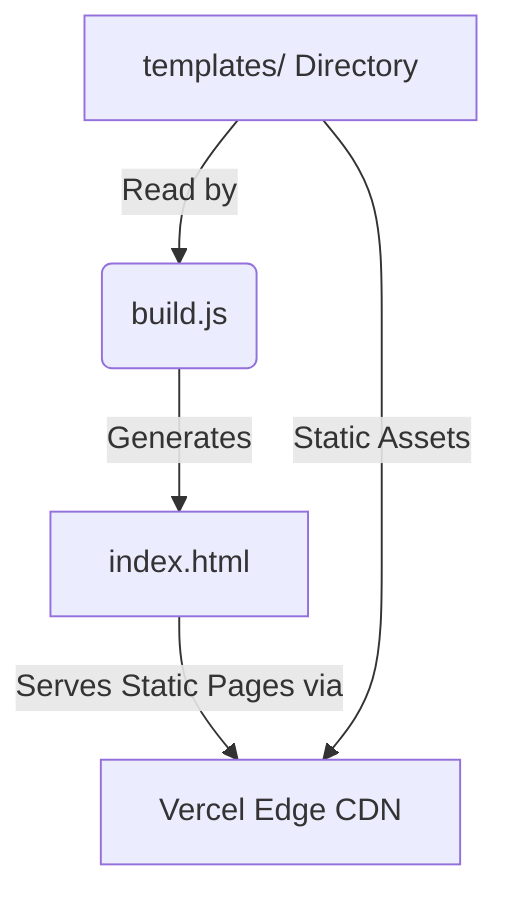

# AyWebSelling Templates Marketplace

A lightning-fast, Vercel-ready static digital marketplace for premium HTML templates.

## Overview

AyWebSelling is a digital marketplace designed to showcase and serve high-quality HTML5 templates. Originally conceived as a dynamic CMS theme, it has been modernized and re-architected into a blazing-fast static site generator (SSG) pipeline. This setup allows for near-instant page loads, supreme security (no database or backend to hack), and effortless deployment on modern edge networks like Vercel.

## Features

- **Static Site Generation:** Uses a custom Node.js build script to dynamically traverse template directories and generate a responsive, SEO-friendly storefront.
- **Categorization:** Automatically organizes products into categories based on file-system structure (Blog, Business, eCommerce, SaaS, etc.).
- **Zero-Dependency Architecture:** Minimalist frontend built with vanilla HTML/CSS and lightweight JavaScript, ensuring maximum performance.
- **Vercel-Ready:** Pre-configured `package.json` and build scripts for seamless continuous deployment to Vercel or any static host.
- **Responsive Design:** A fully responsive grid layout that adapts flawlessly to mobile, tablet, and desktop viewports.

## Tech Stack

- **Frontend:** HTML5, CSS3, Vanilla JS
- **Build System:** Node.js (Custom SSG script)
- **Deployment:** Vercel (Ready)
- **Styling/Assets:** Google Fonts (Inter, Outfit), FontAwesome

## Architecture

The project employs a file-based routing and generation approach:

1. **`templates/` Directory:** Acts as the "database". It stores all HTML templates, grouped by category folders.
2. **`build.js` Script:** At build time, this script recursively reads the `templates/` directory, extracts category names and template titles, and injects them into a pre-designed HTML storefront layout.
3. **`index.html`:** The generated artifact. A fully static frontend that securely links to individual template demos.



## Project Structure

```text
??? assets/             # Global CSS, JS, and Images for the storefront
??? templates/          # The marketplace inventory (organized by category folders)
??? build.js            # Node.js Static Site Generator script
??? index.html          # The generated storefront (Do not edit manually!)
??? package.json        # NPM configuration and build scripts
??? .gitignore          # Git exclusion rules
```

## How It Works

Adding a new template to the store is as simple as creating a new folder:
1. Drop your new HTML template folder into the appropriate category inside `templates/` (e.g., `templates/BUSINESS/MyNewTemplate/`).
2. Run the build command.
3. The storefront (`index.html`) is automatically updated with the new template card and URL routes.

## Running the Project

### Prerequisites
- [Node.js](https://nodejs.org/) installed on your machine.

### Build and Serve Locally
1. Clone the repository.
2. Generate the static storefront:
   ```bash
   npm run build
   ```
3. Serve the site locally:
   ```bash
   npm start
   ```
   *(This uses `npx serve` to launch a local web server).*

## Deployment

This project is optimized for **Vercel**.

1. Push the code to a GitHub repository.
2. Import the repository in your Vercel Dashboard.
3. Vercel will automatically detect the `package.json`.
4. The Build Command will run (`npm run build`), and the Output Directory will be the root.
5. Deploy!

## Technical Highlights

- **Custom SSG:** Instead of relying on heavy frameworks like Next.js or Nuxt for a simple use case, I wrote a custom `build.js` script using Node's `fs` and `path` modules. This reduces the dependency graph to zero, minimizing attack vectors and maintenance overhead.
- **URL Encoding Handling:** The build script implements robust URL encoding for paths (`encodeURIComponent`), ensuring that template folders with spaces or special characters map correctly in the generated HTML links.

## License

MIT License

